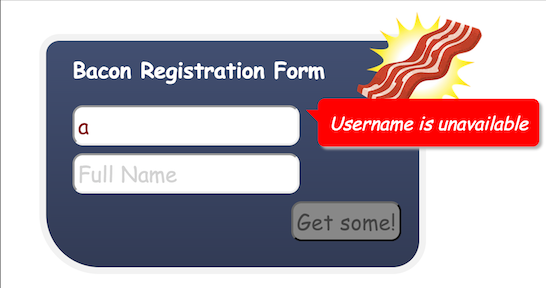
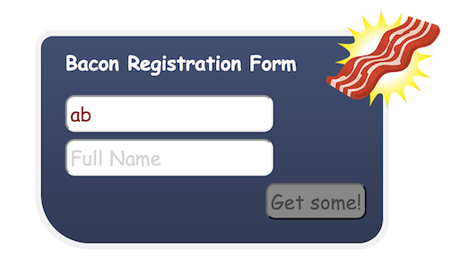
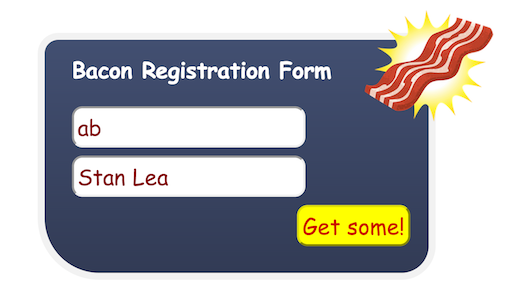
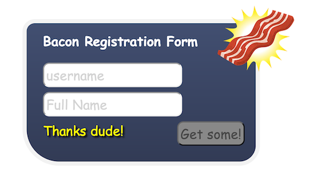

## Using streams to define event-driven components

 
 

        function wireAjaxOnChange(input, svcInfo, init) {
            var request = input.changes().filter(nonEmpty).skipDuplicates().throttle(300)
                    .map(svcInfo);

            var response = request.ajax();

            return {
                requestEntered: input.map(nonEmpty),
                responsePending: request.awaiting(response),
                responseValue: response.toProperty(init)
            }
        }

        function wireAjaxOnEvent(eventStream, svcTemplate) {
            var request = Bacon.combineTemplate(svcTemplate).sampledBy(eventStream);
            var response = request.ajax();

            return {
                requestEntered: request.map(true).toProperty(false),
                responsePending: request.awaiting(response),
                responseStream: response
            }
        }

        function createComponent() {
            var model = new Bacon.Model({});
            var username = model.lens("username");
            var fullname = model.lens("fullname");

            var streams = {};
            streams["checkAvailability"] = new Bacon.Bus();
            streams["registration"] = new Bacon.Bus();

            streams["checkAvailability"].plug(username);

            var userNameWire = wireAjaxOnChange(streams["checkAvailability"].toProperty(), function (user) {
                return { url: "/usernameavailable/" + user };
            }, true);

            userNameWire.requestEntered.onValue(function () {
                model.lens("fullname").set("");
            });

            // registration
            var registrationWire = wireAjaxOnEvent(streams["registration"], {
                type: "post",
                url: "/register",
                contentType: "application/json",
                data: JSON.stringify(model.get())
            });

            return {
                model: model,
                bind: function(name, stream) {
                   model.lens(name).bind(stream);
                },
                plug: function(name, stream) {
                    streams[name].plug(stream);
                },
                usernameEntered: userNameWire.requestEntered,
                usernameAvailable: userNameWire.responseValue,
                availabilityPending: userNameWire.responsePending,
                registrationPending: registrationWire.responsePending,
                registrationSent: registrationWire.requestEntered,
                registrationResponse: registrationWire.responseStream
            }
        }

        function show(x) {
            console.log(x);
        }

        function nonEmpty(x) {
            return x && x.length > 0;
        }

        function setVisibility(element, visible) {
            element.toggle(visible);
        }

        function setEnabled(element, enabled) {
            element.attr("disabled", !enabled);
        }

        function createView(component) {

            // fields
            var usernameField = $("#username input");
            var fullnameField = $("#fullname input");
            var registerButton = $("#register button");
            var unavailabilityLabel = $("#username-unavailable");
            var usernameAjaxIndicator = $("#username .ajax");
            var registerAjaxIndicator = $("#register .ajax");

            component.plug("registration", registerButton.asEventStream("click").doAction(".preventDefault"));
            component.usernameAvailable.not().and(component.availabilityPending.not()).onValue(setVisibility, unavailabilityLabel);
            component.availabilityPending.onValue(setVisibility, usernameAjaxIndicator);

            var fullnameEntered = component.model.lens("fullname").map(nonEmpty);

            var fullnameEnabled = component.usernameEntered.and(component.usernameAvailable)
                    .and(component.availabilityPending.not());

            component.bind("username", Bacon.$.textFieldValue(usernameField));
            component.bind("fullname", Bacon.$.textFieldValue(fullnameField));
            component.model.onValue(function (m) {
                $("#result").text("");
                console.log("model", m);
            });

            var registerButtonEnabled = component.usernameEntered.and(fullnameEntered).and(component.usernameAvailable)
                    .and(component.availabilityPending.not()).and(component.registrationSent.not());

            // side-effects
            fullnameEnabled.onValue(setEnabled, fullnameField);
            registerButtonEnabled.onValue(setEnabled, registerButton);
            component.registrationPending.onValue(setVisibility, registerAjaxIndicator);
            component.registrationResponse.onValue(function () {
                component.model.set({username: "", fullname: ""});
                $("#result").text("Thanks dude!");
            })
        }

        $(function () {
            createView(createComponent());
        })
